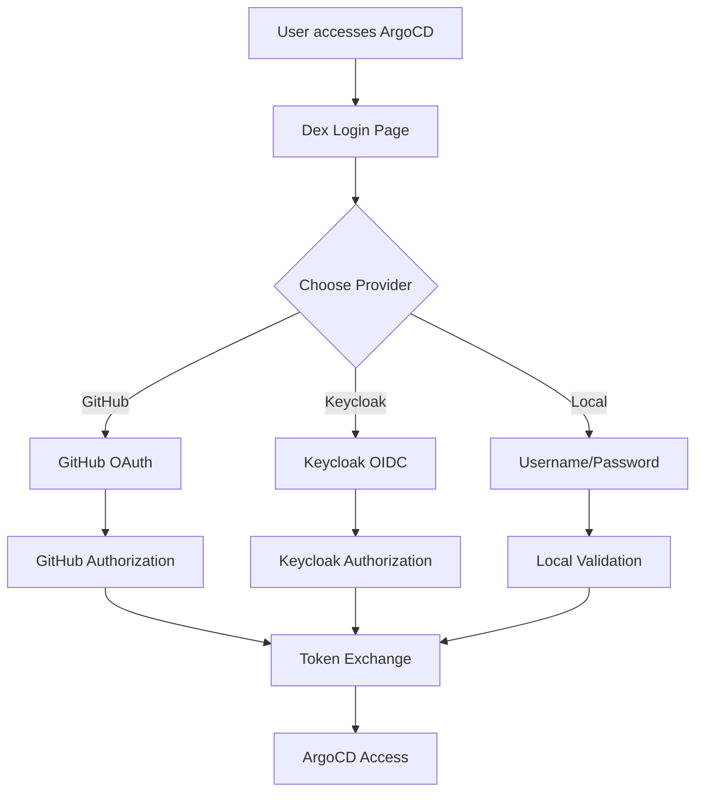

# Complete Authentication Guide for ArgoCD

This comprehensive guide covers all aspects of ArgoCD authentication, including multi-provider setup, Keycloak configuration, and deployment procedures.

## Table of Contents

- [Overview](#overview)
- [Authentication Providers](#authentication-providers)
- [Provider Configuration](#provider-configuration)
- [Keycloak Setup](#keycloak-setup)
- [Deployment Guide](#deployment-guide)
- [Role-Based Access Control](#role-based-access-control)
- [User Experience](#user-experience)
- [Testing & Verification](#testing--verification)
- [Troubleshooting](#troubleshooting)
- [Security Considerations](#security-considerations)
- [Monitoring & Auditing](#monitoring--auditing)

## Overview

ArgoCD is configured to support multiple authentication providers simultaneously, allowing users to choose their preferred authentication method. This setup provides flexibility, redundancy, and scalability for diverse user populations.

### Supported Authentication Methods

1. **GitHub OAuth** - For ITlusions organization members
2. **Keycloak OIDC** - For broader organizational access (optional)
3. **Local Users** - For service accounts and emergency access

### Benefits of Multi-Provider Authentication

- **Flexibility**: Users can choose their preferred authentication method
- **Redundancy**: Multiple authentication paths reduce single points of failure
- **Integration**: Leverage existing identity providers
- **Scalability**: Support diverse user populations

## Authentication Providers

### 1. GitHub OAuth (Primary)
- **Target Audience**: ITlusions organization members
- **Integration**: Direct GitHub OAuth via Dex
- **Group Mapping**: GitHub teams → ArgoCD roles
- **Status**: ✅ Active and configured

### 2. Keycloak OIDC (Optional)
- **Target Audience**: Broader organizational users
- **Integration**: OpenID Connect via Dex
- **Group Mapping**: Keycloak groups → ArgoCD roles
- **Status**: 🔧 Configurable

### 3. Local Users
- **Target Audience**: Service accounts and emergency access
- **Integration**: ArgoCD built-in authentication
- **Management**: Via Helm chart values
- **Status**: ✅ Active with automation account

## Provider Configuration

### GitHub OAuth Configuration

```yaml
# In values.yaml
github:
  org: "ITlusions"
  clientId: "your-github-client-id"
  clientSecret: "your-github-client-secret"
```

**Team Mappings:**
- `ITlusions:Admins` → admin role
- `ITlusions:Devops` → admin role
- `ITlusions:Developers` → developer role
- `ITlusions:Readonly` → readonly role

### Keycloak OIDC Configuration

```yaml
# In values.yaml
keycloak:
  enabled: true  # Set to false to disable
  issuer: "https://your-keycloak-domain/realms/your-realm"
  clientId: "argocd"
  clientSecret: "your-client-secret"
  redirectURI: "https://argocd.dev.itlusions.nl/auth/callback"
  scopes:
    - "openid"
    - "profile" 
    - "email"
    - "groups"
  groupsClaim: "groups"
```

**Group Mappings:**
- `argocd-admins` → admin role
- `argocd-developers` → developer role
- `argocd-readonly` → readonly role

### Local Users Configuration

```yaml
# In values.yaml
users:
  - name: "automation"
    password: "auto-generated"  # Generated on each deployment
    role: "admin"
```

## Keycloak Setup

### Prerequisites

- Keycloak server with admin access
- ArgoCD deployed with this Helm chart
- Understanding of OIDC configuration

### 1. Create OIDC Client in Keycloak

1. **Login to Keycloak Admin Console**
   - Navigate to your realm
   - Go to **Clients** → **Create Client**

2. **Basic Client Configuration**
   ```
   Client type: OpenID Connect
   Client ID: argocd
   Name: ArgoCD OIDC Client
   ```

3. **Settings Tab Configuration**
   ```
   Client authentication: On
   Authorization: Off
   Standard flow: On
   Direct access grants: Off
   Service accounts roles: Off
   ```

4. **Access Settings**
   ```
   Valid redirect URIs: https://argocd.dev.itlusions.nl/auth/callback
   Web origins: https://argocd.dev.itlusions.nl
   ```

5. **Save Configuration**

### 2. Get Client Credentials

1. Go to **Credentials** tab
2. Copy the **Client secret** (needed for values.yaml)

### 3. Configure Groups (Optional)

Create groups in Keycloak to map to ArgoCD roles:
- `argocd-admins` → Maps to ArgoCD admin role
- `argocd-developers` → Maps to ArgoCD developer role  
- `argocd-readonly` → Maps to ArgoCD readonly role

### 4. Configure Group Claims

1. Go to **Client scopes** → **argocd-dedicated** → **Mappers**
2. Create a new mapper:
   ```
   Name: groups
   Mapper type: Group Membership
   Token claim name: groups
   Full group path: Off
   Add to ID token: On
   Add to access token: On
   Add to userinfo: On
   ```

### Advanced Keycloak Configuration

#### Custom Scopes

```yaml
keycloak:
  scopes:
    - "openid"
    - "profile"
    - "email" 
    - "groups"
    - "roles"  # If using realm/client roles
```

#### Role-based Claims

If using Keycloak roles instead of groups:

```yaml
keycloak:
  groupsClaim: "roles"  # or "realm_access.roles"
```

## Deployment Guide

### Prerequisites

- Kubernetes cluster with ArgoCD namespace
- Helm 3.x installed
- Access to both GitHub organization and Keycloak server
- Admin access to ArgoCD

### Step 1: Prepare Keycloak Client

Before deploying, ensure your Keycloak client is properly configured:

```bash
# Test Keycloak OIDC discovery endpoint
curl -s https://your-keycloak-domain/realms/your-realm/.well-known/openid_configuration | jq .
```

Expected response should include:
- `authorization_endpoint`
- `token_endpoint`
- `userinfo_endpoint`
- `issuer` matching your configuration

### Step 2: Update values.yaml

Configure both authentication providers in `Chart/values.yaml`:

```yaml
# GitHub OAuth Configuration
github:
  org: "ITlusions"
  clientId: "your-github-client-id"
  clientSecret: "your-github-client-secret"

# Keycloak OIDC Configuration
keycloak:
  enabled: true  # Set to false to disable Keycloak
  issuer: "https://your-keycloak-domain/realms/your-realm"
  clientId: "argocd"
  clientSecret: "your-keycloak-client-secret"
  redirectURI: "https://argocd.dev.itlusions.nl/auth/callback"
  scopes:
    - "openid"
    - "profile" 
    - "email"
    - "groups"
  groupsClaim: "groups"

# Local users (automation accounts)
users:
  - name: "automation"
    password: ""  # Will be auto-generated
    role: "admin"
```

### Step 3: Verify Current Configuration

```bash
# Check current authentication configuration
kubectl get configmap argocd-cm -n argocd -o yaml | grep -A 20 "dex.config"

# Check current RBAC configuration
kubectl get configmap argocd-rbac-cm -n argocd -o yaml
```

### Step 4: Deploy Configuration Changes

```bash
# Navigate to chart directory
cd Chart

# Validate the configuration
helm template argocd . -f values.yaml --debug

# Deploy the updated configuration
helm upgrade argocd . -n argocd -f values.yaml

# Verify deployment
kubectl get pods -n argocd
```

### Step 5: Restart ArgoCD Components

```bash
# Restart Dex server (authentication provider)
kubectl rollout restart deployment argocd-dex-server -n argocd

# Restart ArgoCD server
kubectl rollout restart deployment argocd-server -n argocd

# Wait for rollout to complete
kubectl rollout status deployment argocd-dex-server -n argocd
kubectl rollout status deployment argocd-server -n argocd
```

## Role-Based Access Control

### Role Definitions

| Role | Permissions | Description |
|------|-------------|-------------|
| **admin** | Full access | Complete ArgoCD administration |
| **developer** | App management | Deploy/sync applications |
| **readonly** | View only | Read-only access to all resources |

### Permission Matrix

| Action | admin | developer | readonly |
|--------|-------|-----------|----------|
| View applications | ✅ | ✅ | ✅ |
| Sync applications | ✅ | ✅ | ❌ |
| Create applications | ✅ | ✅ | ❌ |
| Delete applications | ✅ | ⚠️ Limited | ❌ |
| Manage repositories | ✅ | ❌ | ❌ |
| Manage clusters | ✅ | ❌ | ❌ |
| Manage users | ✅ | ❌ | ❌ |
| View logs | ✅ | ✅ | ✅ |
| Execute commands | ✅ | ⚠️ Limited | ❌ |

### RBAC Configuration

The RBAC configuration automatically includes mappings for all providers:

```yaml
# GitHub team mappings
g, ITlusions:Admins, role:admin
g, ITlusions:Devops, role:admin
g, ITlusions:Developers, role:developer
g, ITlusions:Readonly, role:readonly

# Keycloak group mappings (when enabled)
g, argocd-admins, role:admin
g, argocd-developers, role:developer
g, argocd-readonly, role:readonly
g, /argocd-admins, role:admin      # Full group paths supported
g, /argocd-developers, role:developer
g, /argocd-readonly, role:readonly

# Local user mappings
g, automation, role:admin
```

## User Experience

### Login Interface

When accessing https://argocd.dev.itlusions.nl, users see:

1. **Log in via GitHub** - For ITlusions organization members
2. **Log in via Keycloak** - For broader organizational access (if enabled)
3. **Username/Password** - For local users

### Authentication Flow



### Provider Priority

Providers are displayed in this order:
1. GitHub OAuth (always first if configured)
2. Keycloak OIDC (if enabled)
3. Local authentication (always available)

## Testing & Verification

### 1. Check Configuration Loading

```bash
# Verify Dex configuration includes both providers
kubectl logs -l app.kubernetes.io/name=argocd-dex-server -n argocd | grep -i "connector\|github\|keycloak"

# Check ArgoCD server recognizes providers
kubectl logs -l app.kubernetes.io/name=argocd-server -n argocd | grep -i "dex\|oidc"
```

### 2. Test Login Interface

1. Navigate to https://argocd.dev.itlusions.nl
2. Verify you see multiple login options:
   - **Log in via GitHub**
   - **Log in via Keycloak** (or your configured display name)
   - **Username/Password** field for local users

### 3. Test GitHub Authentication

1. Click **Log in via GitHub**
2. Should redirect to GitHub OAuth
3. After authorization, verify proper role assignment based on GitHub team membership

### 4. Test Keycloak Authentication

1. Click **Log in via Keycloak**
2. Should redirect to your Keycloak login page
3. After authentication, verify proper role assignment based on Keycloak group membership

### 5. Test Local User Authentication

```bash
# Get auto-generated password for automation user
kubectl get secret argocd-secret -n argocd -o jsonpath='{.data.automation\.password}' | base64 -d
```

Use this password to test local authentication.

## Troubleshooting

### Common Deployment Issues

#### 1. Keycloak Provider Not Appearing

**Symptoms**: Only GitHub login option visible

**Solutions**:
```bash
# Check if Keycloak is enabled
helm get values argocd -n argocd | grep -A 10 keycloak

# Verify Dex configuration
kubectl get configmap argocd-cm -n argocd -o yaml | grep -A 30 "dex.config"

# Check Dex logs
kubectl logs -l app.kubernetes.io/name=argocd-dex-server -n argocd -f
```

#### 2. Authentication Failures

**Symptoms**: "Failed to authenticate" errors

**Solutions**:
```bash
# Check Keycloak connectivity
kubectl exec -it deployment/argocd-dex-server -n argocd -- wget -O- https://your-keycloak-domain/realms/your-realm/.well-known/openid_configuration

# Verify client credentials
# Review Keycloak client configuration
# Check redirect URI matches exactly
```

#### 3. Authorization Denied

**Symptoms**: Users can login but have no permissions

**Solutions**:
```bash
# Check RBAC configuration
kubectl get configmap argocd-rbac-cm -n argocd -o yaml

# Verify group memberships in Keycloak
# Check group claim mapping
# Test with admin user first
```

### Common Configuration Problems

1. **"Failed to authenticate"**
   - Verify Keycloak client configuration
   - Check redirect URI matches exactly
   - Ensure client secret is correct

2. **"Access denied"**
   - Check RBAC group mappings
   - Verify user is in correct groups
   - Check ArgoCD RBAC configuration

3. **"OIDC provider not found"**
   - Verify Keycloak issuer URL is accessible
   - Check ArgoCD can reach Keycloak server
   - Verify realm name in issuer URL

4. **Provider Not Showing**
   - Check Dex configuration
   - Verify provider is enabled in values.yaml
   - Check ArgoCD server logs

### Debug Commands

```bash
# Get comprehensive ArgoCD configuration
kubectl get configmap argocd-cm -n argocd -o yaml > argocd-config-debug.yaml

# Get RBAC configuration
kubectl get configmap argocd-rbac-cm -n argocd -o yaml > argocd-rbac-debug.yaml

# Get current Helm values
helm get values argocd -n argocd > current-values.yaml

# Check all ArgoCD logs
kubectl logs -l app.kubernetes.io/component=server -n argocd --tail=100
kubectl logs -l app.kubernetes.io/name=argocd-dex-server -n argocd --tail=100

# Test OIDC discovery endpoint
curl https://your-keycloak-domain/realms/your-realm/.well-known/openid_configuration

# Check ArgoCD Dex configuration
kubectl exec -it deployment/argocd-dex-server -n argocd -- cat /shared/dex.yaml
```

### Network Connectivity Tests

```bash
# Test from ArgoCD pod to Keycloak
kubectl exec -it deployment/argocd-dex-server -n argocd -- nslookup your-keycloak-domain

# Test OIDC endpoint
kubectl exec -it deployment/argocd-dex-server -n argocd -- curl -v https://your-keycloak-domain/realms/your-realm/.well-known/openid_configuration
```

### Rollback Procedure

If issues occur, you can quickly rollback:

#### 1. Disable Keycloak Provider

```yaml
# In values.yaml
keycloak:
  enabled: false
```

```bash
# Deploy rollback
helm upgrade argocd ./Chart -n argocd -f values.yaml
kubectl rollout restart deployment argocd-dex-server -n argocd
```

#### 2. Complete Rollback

```bash
# Rollback to previous release
helm rollback argocd -n argocd

# Restart components
kubectl rollout restart deployment argocd-dex-server -n argocd
kubectl rollout restart deployment argocd-server -n argocd
```

## Security Considerations

### Authentication Security

- **OAuth/OIDC**: Uses industry-standard protocols
- **Token Management**: Automatic token refresh and validation
- **Session Management**: Configurable timeout and renewal
- **Transport Security**: All communication over HTTPS

### Authorization Security

- **Principle of Least Privilege**: Users get minimum required permissions
- **Group-based Access**: Permissions inherited from provider groups
- **Regular Auditing**: Monitor access patterns and permissions
- **Emergency Access**: Local admin account for provider failures

### Multi-Provider Benefits & Risks

**Benefits:**
1. **Flexibility**: Users can choose their preferred authentication method
2. **Redundancy**: Multiple authentication paths reduce single points of failure
3. **Integration**: Leverage existing identity providers
4. **Scalability**: Support diverse user populations

**Risks:**
1. **Complexity**: More providers mean more configuration to maintain
2. **Consistency**: Ensure consistent role mappings across providers
3. **Security**: Each provider introduces potential attack vectors
4. **Management**: Multiple user stores to maintain and audit

### Credential Management

1. **Client Secret Management**
   - Store client secrets securely (consider using Kubernetes secrets)
   - Rotate client secrets regularly
   - Don't commit secrets to version control

2. **Group Management**
   - Regularly audit group memberships
   - Use principle of least privilege
   - Monitor access patterns

3. **Network Security**
   - Ensure TLS is enabled for all communication
   - Consider network policies to restrict access
   - Monitor authentication logs

## Monitoring & Auditing

### Authentication Metrics

Monitor these metrics for authentication health:

```bash
# Check authentication provider status
kubectl logs -l app.kubernetes.io/name=argocd-dex-server -n argocd | grep -i "provider\|auth"

# Monitor login attempts
kubectl logs -l app.kubernetes.io/name=argocd-server -n argocd | grep -i "login\|auth"

# Monitor authentication metrics
kubectl logs -l app.kubernetes.io/name=argocd-server -n argocd | grep -i "auth\|login"
```

### User Activity Tracking

```bash
# View user sessions
argocd admin settings rbac can <user> <action> <resource>

# Check current users
kubectl get secret argocd-secret -n argocd -o yaml

# Monitor user activity across providers
kubectl logs -l app.kubernetes.io/name=argocd-server -n argocd | grep -i "user\|role"
```

### Monitoring Setup

- Set up alerts for authentication failures
- Monitor both GitHub and Keycloak provider health
- Track permission changes and group memberships
- Monitor network connectivity to external providers

## Provider Management

### Adding New Providers

1. **Configure Provider** in values.yaml
2. **Update Dex Configuration** in argocd-server-config-cm.yaml
3. **Add RBAC Mappings** in argocd-rbac-cm.yaml
4. **Deploy Changes** and restart ArgoCD

### Disabling Providers

To disable Keycloak (example):

```yaml
keycloak:
  enabled: false
```

Deploy the changes to remove the provider from the login interface.

## Post-Deployment Tasks

### 1. User Group Management

- Add users to appropriate Keycloak groups
- Test permissions for each user type
- Document group membership for your organization

### 2. Documentation Updates

- Update internal documentation with authentication options
- Share login instructions with your team
- Document emergency access procedures

### 3. Monitoring Setup

- Monitor authentication metrics
- Set up alerts for authentication failures
- Track provider health and availability

## Next Steps

After successful deployment:

1. **Configure User Groups** - Set up proper role mappings for all providers
2. **Test CLI Access** - Verify CLI works with all authentication methods
3. **Generate API Tokens** - Set up automation access for CI/CD
4. **Monitor Authentication** - Implement ongoing monitoring and alerting
5. **Regular Auditing** - Establish procedures for access reviews

## Related Documentation

- [CLI Login Guide](CLI_LOGIN.md)
- [Token Management](TOKENS.md)
- [User Management](USER_MANAGEMENT.md)
- [GitHub Setup](GITHUB_SETUP.md)

---

*This complete authentication guide consolidates all authentication-related documentation for the ITL.ArgoCD deployment. For specific implementation details, refer to the individual configuration files in the Chart/templates/ directory.*